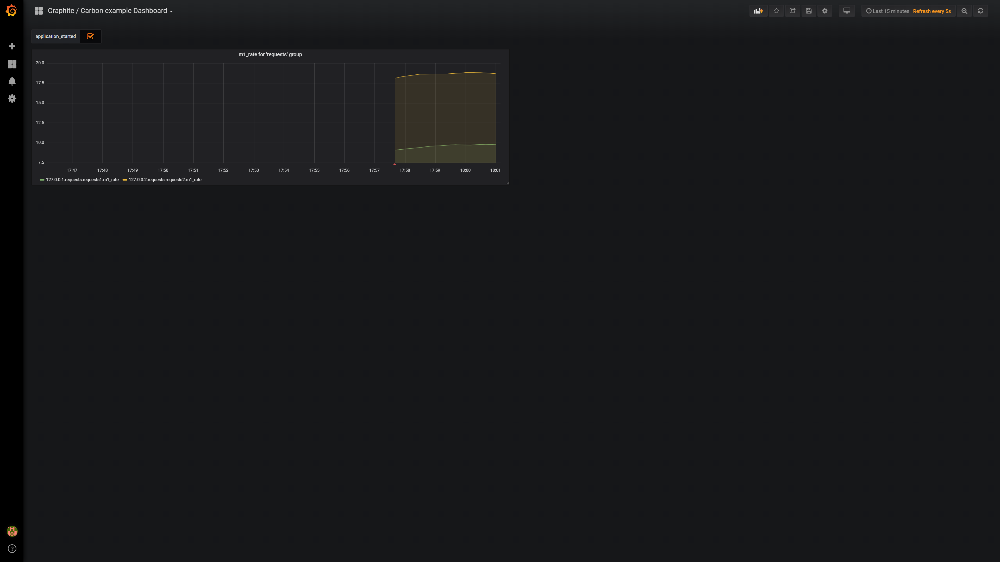

# inspector-carbon
Typescript [Metrics Reporter](https://github.com/rstiller/inspector-metrics/blob/master/lib/metrics/metric-reporter.ts) for
[graphite carbon](https://github.com/graphite-project/carbon).

<p align="center">
    <a href="https://www.npmjs.org/package/inspector-carbon">
        
    </a>
    <a href="https://www.npmjs.org/package/inspector-carbon">
        
    </a>
    <a href="https://travis-ci.org/rstiller/inspector-carbon">
        
    </a>
    <a href="https://david-dm.org/rstiller/inspector-carbon">
        
    </a>
</p>

This library is made for [inspector-metrics](https://github.com/rstiller/inspector-metrics) node module and
is meant to be used with `nodejs`.  
It uses [node-graphite](https://github.com/felixge/node-graphite) as graphite/carbon client.

## install

`npm install --save inspector-carbon`

## basic usage

```typescript
import { MetricRegistry } from "inspector-metrics";
import { CarbonMetricReporter } from "inspector-carbon";

// instance the carbon reporter
const reporter: CarbonMetricReporter = new CarbonMetricReporter({
    host: "http://graphite-server/",
});
const registry: MetricRegistry = new MetricRegistry();

// add the registry to the reporter
reporter.addMetricRegistry(registry);
// start reporting
await reporter.start();
```

### set common tags for all metrics

```typescript
import { MetricRegistry } from "inspector-metrics";
import { CarbonMetricReporter } from "inspector-carbon";

// instance the carbon reporter
const reporter: CarbonMetricReporter = new CarbonMetricReporter({
    host: "http://graphite-server/",
});

// set common tags for all metrics
reporter.getTags().set("app-name", "my-service");
reporter.getTags().set("app-version", "v1.2.3");
```

### reporting events

```typescript
import { Event, MetricRegistry } from "inspector-metrics";
import { CarbonMetricReporter } from "inspector-carbon";

// instance the carbon reporter
const reporter: CarbonMetricReporter = new CarbonMetricReporter({
    host: "http://graphite-server/",
});

// build an ad-hoc event
const event = new Event<number>("application_started")
    .setValue(1.0)
    .setTag("mode", "test")
    .setTag("customTag", "specialValue");

// send the event to graphite
reporter.reportEvent(event);
```

## dev

### using the playground

To use the playground you need to have `docker` and `docker-compose` installed.

```bash
# boots all services (graphite / grafana) and provisions the example dashboard
test-env/boot.sh
# running playground script
./playground.sh
```

### view data in grafana

1. Navigate to `http://localhost:3000`
1. select example dashboard (upper left corner: "Home") "Graphite / Carbon example Dashboard"



## License

[MIT](https://www.opensource.org/licenses/mit-license.php)
