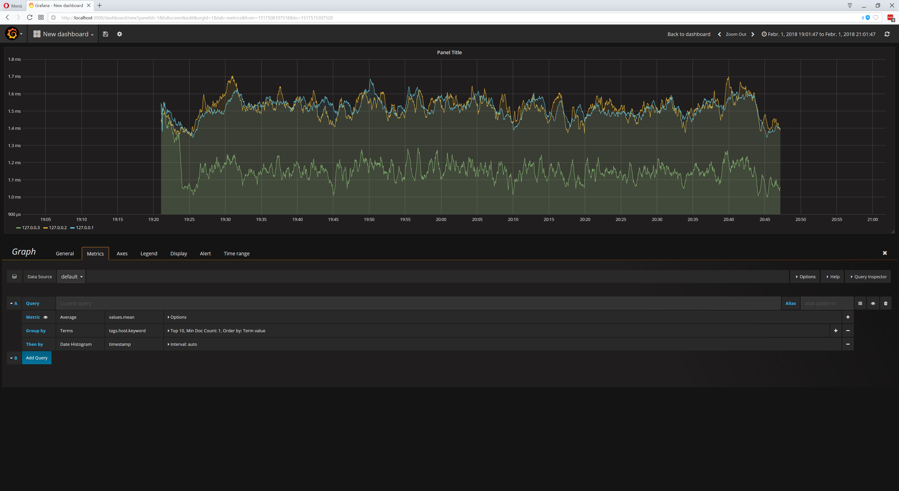
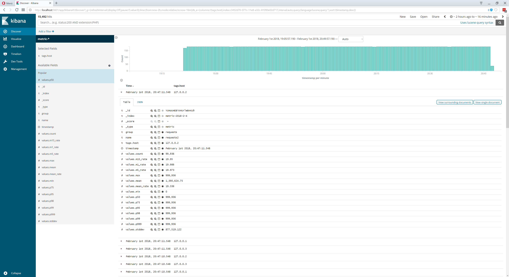

# inspector-elasticsearch
Typescript [Metrics Reporter](https://github.com/rstiller/inspector-metrics/blob/master/lib/metrics/metric-reporter.ts) for
[elasticsearch](https://www.elastic.co/de/products/elasticsearch).

<p align="center">
    <a href="https://www.npmjs.org/package/inspector-elasticsearch">
        
    </a>
    <a href="https://www.npmjs.org/package/inspector-elasticsearch">
        
    </a>
    <a href="https://travis-ci.org/rstiller/inspector-elasticsearch">
        
    </a>
    <a href="https://david-dm.org/rstiller/inspector-elasticsearch">
        
    </a>
</p>

This library is made for [inspector-metrics](https://github.com/rstiller/inspector-metrics) node module and
is meant to be used with `typescript` / `nodejs`.  
It uses [elasticsearch-js](https://github.com/elastic/elasticsearch-js) as elasticsearch client.

## install

`npm install --save inspector-elasticsearch`

## basic usage

```typescript
import { MetricRegistry } from "inspector-metrics";
import { ElasticsearchMetricReporter } from "inspector-elasticsearch";
import { ConfigOptions } from "elasticsearch";

const clientOptions: ConfigOptions = {
    apiVersion: "6.0",
    host: "localhost:9200",
};
// instance the elasticsearch reporter
const reporter: ElasticsearchMetricReporter = new ElasticsearchMetricReporter({
    clientOptions,
});
const registry: MetricRegistry = new MetricRegistry();

// add the registry to the reporter
reporter.addMetricRegistry(registry);
// start reporting
reporter.start();
```

### determine the indexname for a metric

```typescript
import { MetricRegistry } from "inspector-metrics";
import {
    ElasticsearchMetricReporter,
    MetricInfoDeterminator
} from "inspector-elasticsearch";
import { ConfigOptions } from "elasticsearch";

const clientOptions: ConfigOptions = { ... };
// computes the name of the index using the timestamp of the metric
const indexnameDeterminator: MetricInfoDeterminator = (
    registry: MetricRegistry,
    metric: Metric,
    type: MetricType,
    date: Date) => {
    
    const day = date.getDate();
    const dayPrefix: string = (day >= 10) ? "" : "0";
    const month = date.getMonth() + 1;
    const monthPrefix: string = (month >= 10) ? "" : "0";
    return `metrics-${date.getFullYear()}-${monthPrefix}${month}-${dayPrefix}${day}`;
};
// the indexname generator needs to be specified when instancing the reporter
const reporter: ElasticsearchMetricReporter = new ElasticsearchMetricReporter({
    clientOptions,
    indexnameDeterminator, 
}
);
```

### build a metric document

```typescript
import { MetricRegistry } from "inspector-metrics";
import {
    ElasticsearchMetricReporter,
    MetricDocumentBuilder,
    MetricType
} from "inspector-elasticsearch";
import { ConfigOptions } from "elasticsearch";

const clientOptions: ConfigOptions = { ... };
// only build documents for counter metrics
const metricDocumentBuilder: MetricDocumentBuilder = (
    registry: MetricRegistry,
    metric: Metric,
    type: MetricType,
    timestamp: Date,
    commonTags: Map<string, string>) => {

    if (metric instanceof Counter) {
        const tags = ElasticsearchMetricReporter.buildTags(commonTags, metric);
        const name = metric.getName();
        const group = metric.getGroup();
        return { name, group, tags, timestamp, values: { 'count': metric.getCount() }, type };

    } else {
        // null values will not be reported / published
        return null;
    }
};

// the document builder needs to be specified when instancing the reporter
const reporter: ElasticsearchMetricReporter = new ElasticsearchMetricReporter({
    clientOptions,
    metricDocumentBuilder,
});
```

## dev

### using the playground

To use the playground you need to have `docker` and `docker-compose` installed.

```bash
npm run compile
# running playground script
./playground.sh
```

### view data in grafana

1. Navigate to `http://localhost:3000`
1. Add a new Data Source (type: elasticsearch, host / url: http://elasticsearch:9200)
1. Create a new graph



### view data in kibana

1. Navigate to `http://localhost:5601`
1. Add a new index pattern like `metric-*`
1. Discover data



## License

[MIT](https://www.opensource.org/licenses/mit-license.php)
